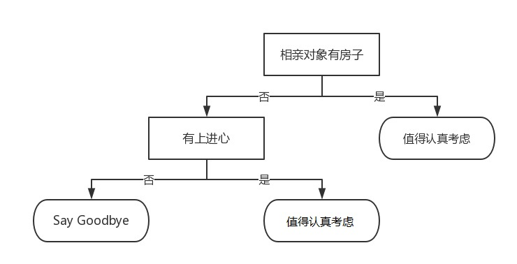
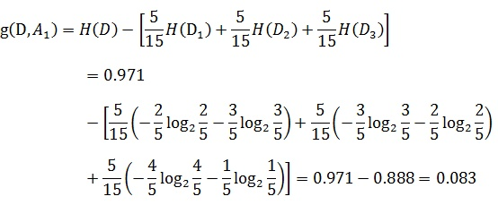
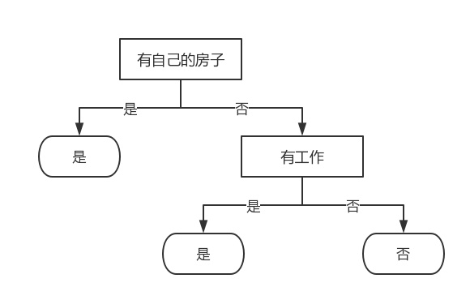
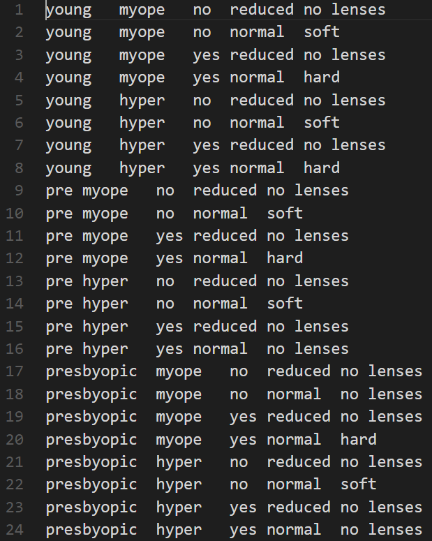
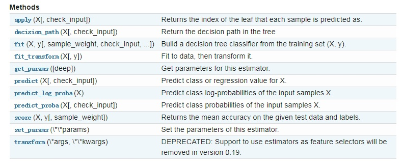
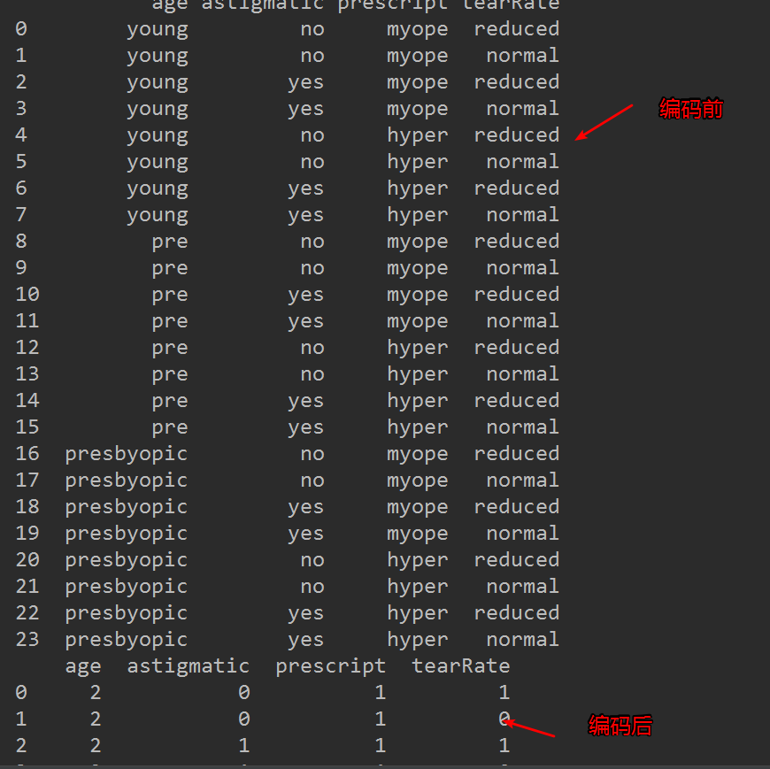
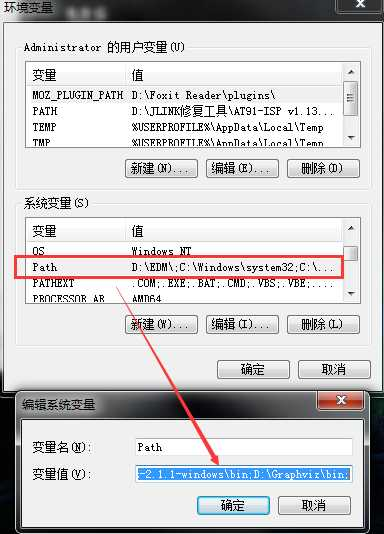

## 一、前言
---
本篇讨论决策树的原理和决策树构建的准备工作，机器学习决策树的原理，以及如何选择最优特征作为分类特征，决策树构建，决策树可视化，使用决策树进行分类预测，决策树的存储和读取以及sklearn实战之预测隐形眼睛类型。

本文出现的所有代码，均可在我的github上下载，欢迎Follow、Star：[Github地址](https://github.com/yaoguangju/machine_learnin)

## 二、决策树的基础
---
#### 1.决策树是什么
决策树是什么？决策树(decision tree)是一种基本的分类与回归方法。举个通俗易懂的例子，如下图所示的流程图就是一个决策树，长方形代表判断模块(decision block)，椭圆形成代表终止模块(terminating block)，表示已经得出结论，可以终止运行。从判断模块引出的左右箭头称作为分支(branch)，它可以达到另一个判断模块或者终止模块。我们还可以这样理解，分类决策树模型是一种描述对实例进行分类的树形结构。决策树由结点(node)和有向边(directed edge)组成。结点有两种类型：内部结点(internal node)和叶结点(leaf node)。内部结点表示一个特征或属性，叶结点表示一个类。蒙圈没？？如下图所示的决策树，长方形和椭圆形都是结点。长方形的结点属于内部结点，椭圆形的结点属于叶结点，从结点引出的左右箭头就是有向边。而最上面的结点就是决策树的根结点(root node)。这样，结点说法就与模块说法对应上了。


我们回到这个流程图，对，你没看错，这就是一个假想的相亲对象分类系统。它首先检测相亲对方是否有房。如果有房，则对于这个相亲对象可以考虑进一步接触。如果没有房，则观察相亲对象是否有上进心，如果没有，直接Say Goodbye，此时可以说："你人很好，但是我们不合适。" 如果有，同样也值得认真考虑。

不过这只是个简单的相亲对象分类系统，只是做了简单的分类。真实情况可能要复杂得多，考虑因素也可以是五花八门。脾气好吗？会做饭吗？愿意做家务吗？家里几个孩子？父母是干什么的？等等各种因素。

我们可以把决策树看成一个if-then规则的集合，将决策树转换成if-then规则的过程是这样的：由决策树的根结点(root node)到叶结点(leaf node)的每一条路径构建一条规则；路径上内部结点的特征对应着规则的条件，而叶结点的类对应着规则的结论。决策树的路径或其对应的if-then规则集合具有一个重要的性质：互斥并且完备。这就是说，每一个实例都被一条路径或一条规则所覆盖，而且只被一条路径或一条规则所覆盖。这里所覆盖是指实例的特征与路径上的特征一致或实例满足规则的条件。

使用决策树做预测需要以下过程：

- 收集数据：可以使用任何方法。比如想构建一个相亲系统，我们可以从媒婆那里，或者通过采访相亲对象获取数据。根据他们考虑的因素和最终的选择结果，就可以得到一些供我们利用的数据了。
- 准备数据：收集完的数据，我们要进行整理，将这些所有收集的信息按照一定规则整理出来，并排版，方便我们进行后续处理。
- 分析数据：可以使用任何方法，决策树构造完成之后，我们可以检查决策树图形是否符合预期。
- 训练算法：这个过程也就是构造决策树，同样也可以说是决策树学习，就是构造一个决策树的数据结构。
- 测试算法：使用经验树计算错误率。当错误率达到了可接收范围，这个决策树就可以投放使用了。
- 使用算法：此步骤可以使用适用于任何监督学习算法，而使用决策树可以更好地理解数据的内在含义。

#### 2.决策树的构建的准备工作
使用决策树做预测的每一步骤都很重要，数据收集不到位，将会导致没有足够的特征让我们构建错误率低的决策树。数据特征充足，但是不知道用哪些特征好，将会导致无法构建出分类效果好的决策树模型。从算法方面看，决策树的构建是我们的核心内容。

决策树要如何构建呢？通常，这一过程可以概括为3个步骤：特征选择、决策树的生成和决策树的修剪。

**特征选择**

特征选择在于选取对训练数据具有分类能力的特征。这样可以提高决策树学习的效率，如果利用一个特征进行分类的结果与随机分类的结果没有很大差别，则称这个特征是没有分类能力的。经验上扔掉这样的特征对决策树学习的精度影响不大。通常特征选择的标准是信息增益(information gain)或信息增益比，为了简单，本文使用信息增益作为选择特征的标准。那么，什么是信息增益？在讲解信息增益之前，让我们看一组实例，贷款申请样本数据表。


希望通过所给的训练数据学习一个贷款申请的决策树，用于对未来的贷款申请进行分类，即当新的客户提出贷款申请时，根据申请人的特征利用决策树决定是否批准贷款申请。

特征选择就是决定用哪个特征来划分特征空间。比如，我们通过上述数据表得到两个可能的决策树，分别由两个不同特征的根结点构成。


图(a)所示的根结点的特征是年龄，有3个取值，对应于不同的取值有不同的子结点。图(b)所示的根节点的特征是工作，有2个取值，对应于不同的取值有不同的子结点。两个决策树都可以从此延续下去。问题是：究竟选择哪个特征更好些？这就要求确定选择特征的准则。直观上，如果一个特征具有更好的分类能力，或者说，按照这一特征将训练数据集分割成子集，使得各个子集在当前条件下有最好的分类，那么就更应该选择这个特征。信息增益就能够很好地表示这一直观的准则。

什么是信息增益呢？在划分数据集之后信息发生的变化称为信息增益，知道如何计算信息增益，我们就可以计算每个特征值划分数据集获得的信息增益，获得信息增益最高的特征就是最好的选择。

**（1）香农熵**

在可以评测哪个数据划分方式是最好的数据划分之前，我们必须学习如何计算信息增益。集合信息的度量方式成为香农熵或者简称为熵(entropy)，这个名字来源于信息论之父克劳德·香农。

如果看不明白什么是信息增益和熵，请不要着急，因为他们自诞生的那一天起，就注定会令世人十分费解。克劳德·香农写完信息论之后，约翰·冯·诺依曼建议使用"熵"这个术语，因为大家都不知道它是什么意思。

熵定义为信息的期望值。在信息论与概率统计中，熵是表示随机变量不确定性的度量。如果待分类的事物可能划分在多个分类之中，则符号xi的信息定义为 ：


其中p(xi)是选择该分类的概率。有人可能会问，信息为啥这样定义啊？答曰：前辈得出的结论。这就跟1+1等于2一样，记住并且会用即可。上述式中的对数以2为底，也可以e为底(自然对数)。

通过上式，我们可以得到所有类别的信息。为了计算熵，我们需要计算所有类别所有可能值包含的信息期望值(数学期望)，通过下面的公式得到：


其中n是分类的数目。熵越大，随机变量的不确定性就越大。

当熵中的概率由数据估计(特别是最大似然估计)得到时，所对应的熵称为经验熵(empirical entropy)。什么叫由数据估计？比如有10个数据，一共有两个类别，A类和B类。其中有7个数据属于A类，则该A类的概率即为十分之七。其中有3个数据属于B类，则该B类的概率即为十分之三。浅显的解释就是，这概率是我们根据数据数出来的。我们定义贷款申请样本数据表中的数据为训练数据集D，则训练数据集D的经验熵为H(D)，|D|表示其样本容量，及样本个数。设有K个类Ck, = 1,2,3,...,K,|Ck|为属于类Ck的样本个数，因此经验熵公式就可以写为 ：


根据此公式计算经验熵H(D)，分析贷款申请样本数据表中的数据。最终分类结果只有两类，即放贷和不放贷。根据表中的数据统计可知，在15个数据中，9个数据的结果为放贷，6个数据的结果为不放贷。所以数据集D的经验熵H(D)为：


经过计算可知，数据集D的经验熵H(D)的值为0.971。

**（2）编写代码计算经验熵**

在编写代码之前，我们先对数据集进行属性标注。

- 年龄：0代表青年，1代表中年，2代表老年；
- 有工作：0代表否，1代表是；
- 有自己的房子：0代表否，1代表是；
- 信贷情况：0代表一般，1代表好，2代表非常好；
- 类别(是否给贷款)：no代表否，yes代表是。

确定这些之后，我们就可以创建数据集，并计算经验熵了，代码编写如下：
```python
# -*- coding: UTF-8 -*-
from math import log

"""
函数说明:创建测试数据集

Parameters:
	无
Returns:
	dataSet - 数据集
	labels - 特征标签

"""
def createDataSet():
	dataSet = [[0, 0, 0, 0, 'no'],						     #数据集
			[0, 0, 0, 1, 'no'],
			[0, 1, 0, 1, 'yes'],
			[0, 1, 1, 0, 'yes'],
			[0, 0, 0, 0, 'no'],
			[1, 0, 0, 0, 'no'],
			[1, 0, 0, 1, 'no'],
			[1, 1, 1, 1, 'yes'],
			[1, 0, 1, 2, 'yes'],
			[1, 0, 1, 2, 'yes'],
			[2, 0, 1, 2, 'yes'],
			[2, 0, 1, 1, 'yes'],
			[2, 1, 0, 1, 'yes'],
			[2, 1, 0, 2, 'yes'],
			[2, 0, 0, 0, 'no']]
	labels = ['年龄', '有工作', '有自己的房子', '信贷情况']		#特征标签
	return dataSet, labels                                   #返回数据集和分类属性

"""
函数说明:计算给定数据集的经验熵(香农熵)

Parameters:
	dataSet - 数据集
Returns:
	shannonEnt - 经验熵(香农熵)
	
"""
def calcShannonEnt(dataSet):
	numEntires = len(dataSet)                       #返回数据集的行数
	labelCounts = {}                                #保存每个标签(Label)出现次数的字典
	for featVec in dataSet:	                        #对每组特征向量进行统计
		currentLabel = featVec[-1]	                #提取标签(Label)信息
		if currentLabel not in labelCounts.keys():	#如果标签(Label)没有放入统计次数的字典,添加进去
			labelCounts[currentLabel] = 0
		labelCounts[currentLabel] += 1				#Label计数
	shannonEnt = 0.0								#经验熵(香农熵)
	for key in labelCounts:							#计算香农熵
		prob = float(labelCounts[key]) / numEntires	#选择该标签(Label)的概率
		shannonEnt -= prob * log(prob, 2)			#利用公式计算
	return shannonEnt								#返回经验熵(香农熵)

if __name__ == '__main__':
	dataSet, features = createDataSet()
	print(dataSet)
	print(calcShannonEnt(dataSet))

```

代码运行结果如下图所示，代码是先打印训练数据集，然后打印计算的经验熵H(D)，程序计算的结果与我们统计计算的结果是一致的，程序没有问题。


**（3） 信息增益**

在上面，我们已经说过，如何选择特征，需要看信息增益。也就是说，信息增益是相对于特征而言的，信息增益越大，特征对最终的分类结果影响也就越大，我们就应该选择对最终分类结果影响最大的那个特征作为我们的分类特征。

在讲解信息增益定义之前，我们还需要明确一个概念，条件熵。

熵我们知道是什么，条件熵又是个什么鬼？条件熵H(Y|X)表示在已知随机变量X的条件下随机变量Y的不确定性，随机变量X给定的条件下随机变量Y的条件熵(conditional entropy)H(Y|X)，定义为X给定条件下Y的条件概率分布的熵对X的数学期望：


这里，


同理，当条件熵中的概率由数据估计(特别是极大似然估计)得到时，所对应的条件熵成为条件经验熵(empirical conditional entropy)。

明确了条件熵和经验条件熵的概念。接下来，让我们说说信息增益。前面也提到了，信息增益是相对于特征而言的。所以，特征A对训练数据集D的信息增益g(D,A)，定义为集合D的经验熵H(D)与特征A给定条件下D的经验条件熵H(D|A)之差，即：


一般地，熵H(D)与条件熵H(D|A)之差成为互信息(mutual information)。决策树学习中的信息增益等价于训练数据集中类与特征的互信息。

设特征A有n个不同的取值{a1,a2,···,an}，根据特征A的取值将D划分为n个子集{D1,D2，···,Dn}，|Di|为Di的样本个数。记子集Di中属于Ck的样本的集合为Dik，即Dik = Di ∩ Ck，|Dik|为Dik的样本个数。于是经验条件熵的公式可以些为：


说了这么多概念性的东西，没有听懂也没有关系，举几个例子，再回来看一下概念，就懂了。

以贷款申请样本数据表为例进行说明。看下年龄这一列的数据，也就是特征A1，一共有三个类别，分别是：青年、中年和老年。我们只看年龄是青年的数据，年龄是青年的数据一共有5个，所以年龄是青年的数据在训练数据集出现的概率是十五分之五，也就是三分之一。同理，年龄是中年和老年的数据在训练数据集出现的概率也都是三分之一。现在我们只看年龄是青年的数据的最终得到贷款的概率为五分之二，因为在五个数据中，只有两个数据显示拿到了最终的贷款，同理，年龄是中年和老年的数据最终得到贷款的概率分别为五分之三、五分之四。所以计算年龄的信息增益，过程如下：




同理，计算其余特征的信息增益g(D,A2)、g(D,A3)和g(D,A4)。分别为：


最后，比较特征的信息增益，由于特征A3(有自己的房子)的信息增益值最大，所以选择A3作为最优特征。

**（4） 编写代码计算信息增益**

我们已经学会了通过公式计算信息增益，接下来编写代码，计算信息增益。
```python
# -*- coding: UTF-8 -*-
from math import log

"""
函数说明:计算给定数据集的经验熵(香农熵)

Parameters:
	dataSet - 数据集
Returns:
	shannonEnt - 经验熵(香农熵)
	
"""
def calcShannonEnt(dataSet):
	numEntires = len(dataSet)						#返回数据集的行数
	labelCounts = {}								#保存每个标签(Label)出现次数的字典
	for featVec in dataSet:							#对每组特征向量进行统计
		currentLabel = featVec[-1]					#提取标签(Label)信息
		if currentLabel not in labelCounts.keys():	#如果标签(Label)没有放入统计次数的字典,添加进去
			labelCounts[currentLabel] = 0
		labelCounts[currentLabel] += 1				#Label计数
	shannonEnt = 0.0								#经验熵(香农熵)
	for key in labelCounts:							#计算香农熵
		prob = float(labelCounts[key]) / numEntires	#选择该标签(Label)的概率
		shannonEnt -= prob * log(prob, 2)			#利用公式计算
	return shannonEnt								#返回经验熵(香农熵)

"""
函数说明:创建测试数据集

Parameters:
	无
Returns:
	dataSet - 数据集
	labels - 特征标签

"""
def createDataSet():
	dataSet = [[0, 0, 0, 0, 'no'],						#数据集
			[0, 0, 0, 1, 'no'],
			[0, 1, 0, 1, 'yes'],
			[0, 1, 1, 0, 'yes'],
			[0, 0, 0, 0, 'no'],
			[1, 0, 0, 0, 'no'],
			[1, 0, 0, 1, 'no'],
			[1, 1, 1, 1, 'yes'],
			[1, 0, 1, 2, 'yes'],
			[1, 0, 1, 2, 'yes'],
			[2, 0, 1, 2, 'yes'],
			[2, 0, 1, 1, 'yes'],
			[2, 1, 0, 1, 'yes'],
			[2, 1, 0, 2, 'yes'],
			[2, 0, 0, 0, 'no']]
	labels = ['年龄', '有工作', '有自己的房子', '信贷情况']		#特征标签
	return dataSet, labels 							#返回数据集和分类属性

"""
函数说明:选择最优特征

Parameters:
	dataSet - 数据集
Returns:
	bestFeature - 信息增益最大的(最优)特征的索引值

"""
def chooseBestFeatureToSplit(dataSet):
	numFeatures = len(dataSet[0]) - 1					#特征数量
	baseEntropy = calcShannonEnt(dataSet) 				#计算数据集的香农熵
	bestInfoGain = 0.0  								#信息增益
	bestFeature = -1									#最优特征的索引值
	for i in range(numFeatures): 						#遍历所有特征
		#获取dataSet的第i个所有特征
		featList = [example[i] for example in dataSet]
		uniqueVals = set(featList)     					#创建set集合{},元素不可重复
		newEntropy = 0.0  								#经验条件熵
		for value in uniqueVals: 						#计算信息增益
			subDataSet = splitDataSet(dataSet, i, value) 		#subDataSet划分后的子集
			prob = len(subDataSet) / float(len(dataSet))   		#计算子集的概率
			newEntropy += prob * calcShannonEnt(subDataSet) 	#根据公式计算经验条件熵
		infoGain = baseEntropy - newEntropy 					#信息增益
		print("第%d个特征的增益为%.3f" % (i, infoGain))			#打印每个特征的信息增益
		if (infoGain > bestInfoGain): 							#计算信息增益
			bestInfoGain = infoGain 							#更新信息增益，找到最大的信息增益
			bestFeature = i 									#记录信息增益最大的特征的索引值
	return bestFeature 											#返回信息增益最大的特征的索引值

if __name__ == '__main__':
    dataSet, features = createDataSet()
    print("最优特征索引值:" + str(chooseBestFeatureToSplit(dataSet)))
```


splitDataSet函数是用来选择各个特征的子集的，比如选择年龄(第0个特征)的青年(用0代表)的自己，我们可以调用splitDataSet(dataSet,0,0)这样返回的子集就是年龄为青年的5个数据集。chooseBestFeatureToSplit是选择选择最优特征的函数。运行代码结果如下：


对比我们自己计算的结果，发现结果完全正确！最优特征的索引值为2，也就是特征A3(有自己的房子)。

**决策树生成和修剪**

我们已经学习了从数据集构造决策树算法所需要的子功能模块，包括经验熵的计算和最优特征的选择，其工作原理如下：得到原始数据集，然后基于最好的属性值划分数据集，由于特征值可能多于两个，因此可能存在大于两个分支的数据集划分。第一次划分之后，数据集被向下传递到树的分支的下一个结点。在这个结点上，我们可以再次划分数据。因此我们可以采用递归的原则处理数据集。

构建决策树的算法有很多，比如C4.5、ID3和CART，这些算法在运行时并不总是在每次划分数据分组时都会消耗特征。由于特征数目并不是每次划分数据分组时都减少，因此这些算法在实际使用时可能引起一定的问题。目前我们并不需要考虑这个问题，只需要在算法开始运行前计算列的数目，查看算法是否使用了所有属性即可。

决策树生成算法递归地产生决策树，直到不能继续下去未为止。这样产生的树往往对训练数据的分类很准确，但对未知的测试数据的分类却没有那么准确，即出现过拟合现象。过拟合的原因在于学习时过多地考虑如何提高对训练数据的正确分类，从而构建出过于复杂的决策树。解决这个问题的办法是考虑决策树的复杂度，对已生成的决策树进行简化。


## 三、决策树构建
---
上篇文章也粗略提到过，构建决策树的算法有很多。篇幅原因，本篇文章只使用ID3算法构建决策树。

#### 1.ID3算法

ID3算法的核心是在决策树各个结点上对应信息增益准则选择特征，递归地构建决策树。具体方法是：从根结点(root node)开始，对结点计算所有可能的特征的信息增益，选择信息增益最大的特征作为结点的特征，由该特征的不同取值建立子节点；再对子结点递归地调用以上方法，构建决策树；直到所有特征的信息增益均很小或没有特征可以选择为止。最后得到一个决策树。ID3相当于用极大似然法进行概率模型的选择。

在使用ID3构造决策树之前，我们再分析下数据。


利用上篇文章求得的结果，由于特征A3(有自己的房子)的信息增益值最大，所以选择特征A3作为根结点的特征。它将训练集D划分为两个子集D1(A3取值为"是")和D2(A3取值为"否")。由于D1只有同一类的样本点，所以它成为一个叶结点，结点的类标记为“是”。

对D2则需要从特征A1(年龄)，A2(有工作)和A4(信贷情况)中选择新的特征，计算各个特征的信息增益：


根据计算，选择信息增益最大的特征A2(有工作)作为结点的特征。由于A2有两个可能取值，从这一结点引出两个子结点：一个对应"是"(有工作)的子结点，包含3个样本，它们属于同一类，所以这是一个叶结点，类标记为"是"；另一个是对应"否"(无工作)的子结点，包含6个样本，它们也属于同一类，所以这也是一个叶结点，类标记为"否"。

这样就生成了一个决策树，该决策树只用了两个特征(有两个内部结点)，生成的决策树如下图所示。



这样我们就使用ID3算法构建出来了决策树，接下来，让我们看看如何进行代实现。

#### 2.编写代码构建决策树
我们使用字典存储决策树的结构，比如上小节我们分析出来的决策树，用字典可以表示为：

```python
{'有自己的房子': {0: {'有工作': {0: 'no', 1: 'yes'}}, 1: 'yes'}} 
```    

创建函数majorityCnt统计classList中出现此处最多的元素(类标签)，创建函数createTree用来递归构建决策树。编写代码如下：
```python
# -*- coding: UTF-8 -*-
from math import log
import operator


"""
函数说明:计算给定数据集的经验熵(香农熵)

Parameters:
	dataSet - 数据集
Returns:
	shannonEnt - 经验熵(香农熵)
	
"""
def calcShannonEnt(dataSet):
	numEntires = len(dataSet)						#返回数据集的行数
	labelCounts = {}								#保存每个标签(Label)出现次数的字典
	for featVec in dataSet:							#对每组特征向量进行统计
		currentLabel = featVec[-1]					#提取标签(Label)信息
		if currentLabel not in labelCounts.keys():	#如果标签(Label)没有放入统计次数的字典,添加进去
			labelCounts[currentLabel] = 0
		labelCounts[currentLabel] += 1				#Label计数
	shannonEnt = 0.0								#经验熵(香农熵)
	for key in labelCounts:							#计算香农熵
		prob = float(labelCounts[key]) / numEntires	#选择该标签(Label)的概率
		shannonEnt -= prob * log(prob, 2)			#利用公式计算
	return shannonEnt								#返回经验熵(香农熵)

"""
函数说明:创建测试数据集

Parameters:
	无
Returns:
	dataSet - 数据集
	labels - 特征标签

"""
def createDataSet():
	dataSet = [[0, 0, 0, 0, 'no'],						#数据集
			[0, 0, 0, 1, 'no'],
			[0, 1, 0, 1, 'yes'],
			[0, 1, 1, 0, 'yes'],
			[0, 0, 0, 0, 'no'],
			[1, 0, 0, 0, 'no'],
			[1, 0, 0, 1, 'no'],
			[1, 1, 1, 1, 'yes'],
			[1, 0, 1, 2, 'yes'],
			[1, 0, 1, 2, 'yes'],
			[2, 0, 1, 2, 'yes'],
			[2, 0, 1, 1, 'yes'],
			[2, 1, 0, 1, 'yes'],
			[2, 1, 0, 2, 'yes'],
			[2, 0, 0, 0, 'no']]
	labels = ['年龄', '有工作', '有自己的房子', '信贷情况']		#特征标签
	return dataSet, labels 							#返回数据集和分类属性

"""
函数说明:按照给定特征划分数据集

Parameters:
	dataSet - 待划分的数据集
	axis - 划分数据集的特征
	value - 需要返回的特征的值
Returns:
	无

"""
def splitDataSet(dataSet, axis, value):		
	retDataSet = []										#创建返回的数据集列表
	for featVec in dataSet: 							#遍历数据集
		if featVec[axis] == value:
			reducedFeatVec = featVec[:axis]				#去掉axis特征
			reducedFeatVec.extend(featVec[axis+1:]) 	#将符合条件的添加到返回的数据集
			retDataSet.append(reducedFeatVec)
	return retDataSet		  							#返回划分后的数据集

"""
函数说明:选择最优特征

Parameters:
	dataSet - 数据集
Returns:
	bestFeature - 信息增益最大的(最优)特征的索引值

"""
def chooseBestFeatureToSplit(dataSet):
	numFeatures = len(dataSet[0]) - 1					#特征数量
	baseEntropy = calcShannonEnt(dataSet) 				#计算数据集的香农熵
	bestInfoGain = 0.0  								#信息增益
	bestFeature = -1									#最优特征的索引值
	for i in range(numFeatures): 						#遍历所有特征
		#获取dataSet的第i个所有特征
		featList = [example[i] for example in dataSet]
		uniqueVals = set(featList)     					#创建set集合{},元素不可重复
		newEntropy = 0.0  								#经验条件熵
		for value in uniqueVals: 						#计算信息增益
			subDataSet = splitDataSet(dataSet, i, value) 		#subDataSet划分后的子集
			prob = len(subDataSet) / float(len(dataSet))   		#计算子集的概率
			newEntropy += prob * calcShannonEnt(subDataSet) 	#根据公式计算经验条件熵
		infoGain = baseEntropy - newEntropy 					#信息增益
		# print("第%d个特征的增益为%.3f" % (i, infoGain))			#打印每个特征的信息增益
		if (infoGain > bestInfoGain): 							#计算信息增益
			bestInfoGain = infoGain 							#更新信息增益，找到最大的信息增益
			bestFeature = i 									#记录信息增益最大的特征的索引值
	return bestFeature 											#返回信息增益最大的特征的索引值


"""
函数说明:统计classList中出现此处最多的元素(类标签)

Parameters:
	classList - 类标签列表
Returns:
	sortedClassCount[0][0] - 出现此处最多的元素(类标签)

"""
def majorityCnt(classList):
	classCount = {}
	for vote in classList:	#统计classList中每个元素出现的次数
		if vote not in classCount.keys():classCount[vote] = 0	
		classCount[vote] += 1
	sortedClassCount = sorted(classCount.items(), key = operator.itemgetter(1), reverse = True)		#根据字典的值降序排序
	return sortedClassCount[0][0]	#返回classList中出现次数最多的元素

"""
函数说明:创建决策树

Parameters:
	dataSet - 训练数据集
	labels - 分类属性标签
	featLabels - 存储选择的最优特征标签
Returns:
	myTree - 决策树

"""
def createTree(dataSet, labels, featLabels):
	classList = [example[-1] for example in dataSet]			#取分类标签(是否放贷:yes or no)
	if classList.count(classList[0]) == len(classList):			#如果类别完全相同则停止继续划分
		return classList[0]
	if len(dataSet[0]) == 1:									#遍历完所有特征时返回出现次数最多的类标签
		return majorityCnt(classList)
	bestFeat = chooseBestFeatureToSplit(dataSet)				#选择最优特征
	bestFeatLabel = labels[bestFeat]							#最优特征的标签
	featLabels.append(bestFeatLabel)
	myTree = {bestFeatLabel:{}}									#根据最优特征的标签生成树
	del(labels[bestFeat])										#删除已经使用特征标签
	featValues = [example[bestFeat] for example in dataSet]		#得到训练集中所有最优特征的属性值
	uniqueVals = set(featValues)								#去掉重复的属性值
	for value in uniqueVals:									#遍历特征，创建决策树。						
		myTree[bestFeatLabel][value] = createTree(splitDataSet(dataSet, bestFeat, value), labels, featLabels)
	return myTree


if __name__ == '__main__':
	dataSet, labels = createDataSet()
	featLabels = []
	myTree = createTree(dataSet, labels, featLabels)
	print(myTree)
```

递归创建决策树时，递归有两个终止条件：第一个停止条件是所有的类标签完全相同，则直接返回该类标签；第二个停止条件是使用完了所有特征，仍然不能将数据划分仅包含唯一类别的分组，即决策树构建失败，特征不够用。此时说明数据纬度不够，由于第二个停止条件无法简单地返回唯一的类标签，这里挑选出现数量最多的类别作为返回值。

运行上述代码，我们可以看到如下结果：


可见，我们的决策树已经构建完成了。这时候，有的朋友可能会说，这个决策树看着好别扭，虽然这个能看懂，但是如果多点的结点，就不好看了。能直观点吗？完全没有问题，我们可以使用强大的Matplotlib绘制决策树。

#### 三.决策树可视化

这里代码都是关于Matplotlib的，如果对于Matplotlib不了解的，可以先学习下，Matplotlib的内容这里就不再累述。可视化需要用到的函数：

- getNumLeafs：获取决策树叶子结点的数目
- getTreeDepth：获取决策树的层数
- plotNode：绘制结点
- plotMidText：标注有向边属性值
- plotTree：绘制决策树
- createPlot：创建绘制面板

对可视化决策树的程序进行了详细的注释，直接看代码，调试查看即可。为了显示中文，需要设置FontProperties，代码编写如下：
```python
# -*- coding: UTF-8 -*-
from matplotlib.font_manager import FontProperties
import matplotlib.pyplot as plt
from math import log
import operator
import pickle

"""
函数说明:计算给定数据集的经验熵(香农熵)

Parameters:
	dataSet - 数据集
Returns:
	shannonEnt - 经验熵(香农熵)
	
"""
def calcShannonEnt(dataSet):
	numEntires = len(dataSet)						#返回数据集的行数
	labelCounts = {}								#保存每个标签(Label)出现次数的字典
	for featVec in dataSet:							#对每组特征向量进行统计
		currentLabel = featVec[-1]					#提取标签(Label)信息
		if currentLabel not in labelCounts.keys():	#如果标签(Label)没有放入统计次数的字典,添加进去
			labelCounts[currentLabel] = 0
		labelCounts[currentLabel] += 1				#Label计数
	shannonEnt = 0.0								#经验熵(香农熵)
	for key in labelCounts:							#计算香农熵
		prob = float(labelCounts[key]) / numEntires	#选择该标签(Label)的概率
		shannonEnt -= prob * log(prob, 2)			#利用公式计算
	return shannonEnt								#返回经验熵(香农熵)

"""
函数说明:创建测试数据集

Parameters:
	无
Returns:
	dataSet - 数据集
	labels - 特征标签

"""
def createDataSet():
	dataSet = [[0, 0, 0, 0, 'no'],						#数据集
			[0, 0, 0, 1, 'no'],
			[0, 1, 0, 1, 'yes'],
			[0, 1, 1, 0, 'yes'],
			[0, 0, 0, 0, 'no'],
			[1, 0, 0, 0, 'no'],
			[1, 0, 0, 1, 'no'],
			[1, 1, 1, 1, 'yes'],
			[1, 0, 1, 2, 'yes'],
			[1, 0, 1, 2, 'yes'],
			[2, 0, 1, 2, 'yes'],
			[2, 0, 1, 1, 'yes'],
			[2, 1, 0, 1, 'yes'],
			[2, 1, 0, 2, 'yes'],
			[2, 0, 0, 0, 'no']]
	labels = ['年龄', '有工作', '有自己的房子', '信贷情况']		#特征标签
	return dataSet, labels 							#返回数据集和分类属性

"""
函数说明:按照给定特征划分数据集

Parameters:
	dataSet - 待划分的数据集
	axis - 划分数据集的特征
	value - 需要返回的特征的值
Returns:
	无

"""
def splitDataSet(dataSet, axis, value):		
	retDataSet = []										#创建返回的数据集列表
	for featVec in dataSet: 							#遍历数据集
		if featVec[axis] == value:
			reducedFeatVec = featVec[:axis]				#去掉axis特征
			reducedFeatVec.extend(featVec[axis+1:]) 	#将符合条件的添加到返回的数据集
			retDataSet.append(reducedFeatVec)
	return retDataSet		  							#返回划分后的数据集

"""
函数说明:选择最优特征

Parameters:
	dataSet - 数据集
Returns:
	bestFeature - 信息增益最大的(最优)特征的索引值

"""
def chooseBestFeatureToSplit(dataSet):
	numFeatures = len(dataSet[0]) - 1					#特征数量
	baseEntropy = calcShannonEnt(dataSet) 				#计算数据集的香农熵
	bestInfoGain = 0.0  								#信息增益
	bestFeature = -1									#最优特征的索引值
	for i in range(numFeatures): 						#遍历所有特征
		#获取dataSet的第i个所有特征
		featList = [example[i] for example in dataSet]
		uniqueVals = set(featList)     					#创建set集合{},元素不可重复
		newEntropy = 0.0  								#经验条件熵
		for value in uniqueVals: 						#计算信息增益
			subDataSet = splitDataSet(dataSet, i, value) 		#subDataSet划分后的子集
			prob = len(subDataSet) / float(len(dataSet))   		#计算子集的概率
			newEntropy += prob * calcShannonEnt(subDataSet) 	#根据公式计算经验条件熵
		infoGain = baseEntropy - newEntropy 					#信息增益
		# print("第%d个特征的增益为%.3f" % (i, infoGain))			#打印每个特征的信息增益
		if (infoGain > bestInfoGain): 							#计算信息增益
			bestInfoGain = infoGain 							#更新信息增益，找到最大的信息增益
			bestFeature = i 									#记录信息增益最大的特征的索引值
	return bestFeature 											#返回信息增益最大的特征的索引值


"""
函数说明:统计classList中出现此处最多的元素(类标签)

Parameters:
	classList - 类标签列表
Returns:
	sortedClassCount[0][0] - 出现此处最多的元素(类标签)

"""
def majorityCnt(classList):
	classCount = {}
	for vote in classList:	#统计classList中每个元素出现的次数
		if vote not in classCount.keys():classCount[vote] = 0	
		classCount[vote] += 1
	sortedClassCount = sorted(classCount.items(), key = operator.itemgetter(1), reverse = True)		#根据字典的值降序排序
	return sortedClassCount[0][0]	#返回classList中出现次数最多的元素

"""
函数说明:创建决策树

Parameters:
	dataSet - 训练数据集
	labels - 分类属性标签
	featLabels - 存储选择的最优特征标签
Returns:
	myTree - 决策树

"""
def createTree(dataSet, labels, featLabels):
	classList = [example[-1] for example in dataSet]			#取分类标签(是否放贷:yes or no)
	if classList.count(classList[0]) == len(classList):			#如果类别完全相同则停止继续划分
		return classList[0]
	if len(dataSet[0]) == 1:									#遍历完所有特征时返回出现次数最多的类标签
		return majorityCnt(classList)
	bestFeat = chooseBestFeatureToSplit(dataSet)				#选择最优特征
	bestFeatLabel = labels[bestFeat]							#最优特征的标签
	featLabels.append(bestFeatLabel)
	myTree = {bestFeatLabel:{}}									#根据最优特征的标签生成树
	del(labels[bestFeat])										#删除已经使用特征标签
	featValues = [example[bestFeat] for example in dataSet]		#得到训练集中所有最优特征的属性值
	uniqueVals = set(featValues)								#去掉重复的属性值
	for value in uniqueVals:									#遍历特征，创建决策树。						
		myTree[bestFeatLabel][value] = createTree(splitDataSet(dataSet, bestFeat, value), labels, featLabels)
	return myTree

"""
函数说明:获取决策树叶子结点的数目

Parameters:
	myTree - 决策树
Returns:
	numLeafs - 决策树的叶子结点的数目

"""
def getNumLeafs(myTree):
    numLeafs = 0												#初始化叶子
    firstStr = next(iter(myTree))								#python3中myTree.keys()返回的是dict_keys,不在是list,所以不能使用myTree.keys()[0]的方法获取结点属性，可以使用list(myTree.keys())[0]
    secondDict = myTree[firstStr]								#获取下一组字典
    for key in secondDict.keys():
        if type(secondDict[key]).__name__=='dict':				#测试该结点是否为字典，如果不是字典，代表此结点为叶子结点
            numLeafs += getNumLeafs(secondDict[key])
        else:   numLeafs +=1
    return numLeafs

"""
函数说明:获取决策树的层数

Parameters:
	myTree - 决策树
Returns:
	maxDepth - 决策树的层数

"""
def getTreeDepth(myTree):
    maxDepth = 0												#初始化决策树深度
    firstStr = next(iter(myTree))								#python3中myTree.keys()返回的是dict_keys,不在是list,所以不能使用myTree.keys()[0]的方法获取结点属性，可以使用list(myTree.keys())[0]
    secondDict = myTree[firstStr]								#获取下一个字典
    for key in secondDict.keys():
        if type(secondDict[key]).__name__=='dict':				#测试该结点是否为字典，如果不是字典，代表此结点为叶子结点
            thisDepth = 1 + getTreeDepth(secondDict[key])
        else:   thisDepth = 1
        if thisDepth > maxDepth: maxDepth = thisDepth			#更新层数
    return maxDepth

"""
函数说明:绘制结点

Parameters:
	nodeTxt - 结点名
	centerPt - 文本位置
	parentPt - 标注的箭头位置
	nodeType - 结点格式
Returns:
	无

"""
def plotNode(nodeTxt, centerPt, parentPt, nodeType):
	arrow_args = dict(arrowstyle="<-")											#定义箭头格式
	font = FontProperties(fname=r"c:\windows\fonts\simsun.ttc", size=14)		#设置中文字体
	createPlot.ax1.annotate(nodeTxt, xy=parentPt,  xycoords='axes fraction',	#绘制结点
		xytext=centerPt, textcoords='axes fraction',
		va="center", ha="center", bbox=nodeType, arrowprops=arrow_args, FontProperties=font)

"""
函数说明:标注有向边属性值

Parameters:
	cntrPt、parentPt - 用于计算标注位置
	txtString - 标注的内容
Returns:
	无

""" 
def plotMidText(cntrPt, parentPt, txtString):
	xMid = (parentPt[0]-cntrPt[0])/2.0 + cntrPt[0]											#计算标注位置					
	yMid = (parentPt[1]-cntrPt[1])/2.0 + cntrPt[1]
	createPlot.ax1.text(xMid, yMid, txtString, va="center", ha="center", rotation=30)

"""
函数说明:绘制决策树

Parameters:
	myTree - 决策树(字典)
	parentPt - 标注的内容
	nodeTxt - 结点名
Returns:
	无

""" 
def plotTree(myTree, parentPt, nodeTxt):
	decisionNode = dict(boxstyle="sawtooth", fc="0.8")										#设置结点格式
	leafNode = dict(boxstyle="round4", fc="0.8")											#设置叶结点格式
	numLeafs = getNumLeafs(myTree)  														#获取决策树叶结点数目，决定了树的宽度
	depth = getTreeDepth(myTree)															#获取决策树层数
	firstStr = next(iter(myTree))															#下个字典     											
	cntrPt = (plotTree.xOff + (1.0 + float(numLeafs))/2.0/plotTree.totalW, plotTree.yOff)	#中心位置
	plotMidText(cntrPt, parentPt, nodeTxt)													#标注有向边属性值
	plotNode(firstStr, cntrPt, parentPt, decisionNode)										#绘制结点
	secondDict = myTree[firstStr]															#下一个字典，也就是继续绘制子结点
	plotTree.yOff = plotTree.yOff - 1.0/plotTree.totalD										#y偏移
	for key in secondDict.keys():								
		if type(secondDict[key]).__name__=='dict':											#测试该结点是否为字典，如果不是字典，代表此结点为叶子结点
			plotTree(secondDict[key],cntrPt,str(key))        								#不是叶结点，递归调用继续绘制
		else:																				#如果是叶结点，绘制叶结点，并标注有向边属性值 											
			plotTree.xOff = plotTree.xOff + 1.0/plotTree.totalW
			plotNode(secondDict[key], (plotTree.xOff, plotTree.yOff), cntrPt, leafNode)
			plotMidText((plotTree.xOff, plotTree.yOff), cntrPt, str(key))
	plotTree.yOff = plotTree.yOff + 1.0/plotTree.totalD

"""
函数说明:创建绘制面板

Parameters:
	inTree - 决策树(字典)
Returns:
	无

""" 
def createPlot(inTree):
    fig = plt.figure(1, facecolor='white')													#创建fig
    fig.clf()																				#清空fig
    axprops = dict(xticks=[], yticks=[])
    createPlot.ax1 = plt.subplot(111, frameon=False, **axprops)    							#去掉x、y轴
    plotTree.totalW = float(getNumLeafs(inTree))											#获取决策树叶结点数目
    plotTree.totalD = float(getTreeDepth(inTree))											#获取决策树层数
    plotTree.xOff = -0.5/plotTree.totalW; plotTree.yOff = 1.0;								#x偏移
    plotTree(inTree, (0.5,1.0), '')															#绘制决策树
    plt.show()																				#显示绘制结果

if __name__ == '__main__':
	dataSet, labels = createDataSet()
	featLabels = []
	myTree = createTree(dataSet, labels, featLabels)
	print(myTree)
	createPlot(myTree)
```

不出意外的话，我们就可以得到如下结果，可以看到决策树绘制完成。plotNode函数的工作就是绘制各个结点，比如有自己的房子、有工作、yes、no，包括内结点和叶子结点。plotMidText函数的工作就是绘制各个有向边的属性。


#### 4.使用决策树执行分类

依靠训练数据构造了决策树之后，我们可以将它用于实际数据的分类。在执行数据分类时，需要决策树以及用于构造树的标签向量。然后，程序比较测试数据与决策树上的数值，递归执行该过程直到进入叶子结点；最后将测试数据定义为叶子结点所属的类型。在构建决策树的代码，可以看到，有个featLabels参数。它是用来干什么的？它就是用来记录各个分类结点的，在用决策树做预测的时候，我们按顺序输入需要的分类结点的属性值即可。举个例子，比如我用上述已经训练好的决策树做分类，那么我只需要提供这个人是否有房子，是否有工作这两个信息即可，无需提供冗余的信息。

用决策树做分类的代码很简单，编写代码如下：
```python
# -*- coding: UTF-8 -*-
from matplotlib.font_manager import FontProperties
import matplotlib.pyplot as plt
from math import log
import operator
import pickle

"""
函数说明:计算给定数据集的经验熵(香农熵)

Parameters:
	dataSet - 数据集
Returns:
	shannonEnt - 经验熵(香农熵)
	
"""
def calcShannonEnt(dataSet):
	numEntires = len(dataSet)						#返回数据集的行数
	labelCounts = {}								#保存每个标签(Label)出现次数的字典
	for featVec in dataSet:							#对每组特征向量进行统计
		currentLabel = featVec[-1]					#提取标签(Label)信息
		if currentLabel not in labelCounts.keys():	#如果标签(Label)没有放入统计次数的字典,添加进去
			labelCounts[currentLabel] = 0
		labelCounts[currentLabel] += 1				#Label计数
	shannonEnt = 0.0								#经验熵(香农熵)
	for key in labelCounts:							#计算香农熵
		prob = float(labelCounts[key]) / numEntires	#选择该标签(Label)的概率
		shannonEnt -= prob * log(prob, 2)			#利用公式计算
	return shannonEnt								#返回经验熵(香农熵)

"""
函数说明:创建测试数据集

Parameters:
	无
Returns:
	dataSet - 数据集
	labels - 特征标签

"""
def createDataSet():
	dataSet = [[0, 0, 0, 0, 'no'],						#数据集
			[0, 0, 0, 1, 'no'],
			[0, 1, 0, 1, 'yes'],
			[0, 1, 1, 0, 'yes'],
			[0, 0, 0, 0, 'no'],
			[1, 0, 0, 0, 'no'],
			[1, 0, 0, 1, 'no'],
			[1, 1, 1, 1, 'yes'],
			[1, 0, 1, 2, 'yes'],
			[1, 0, 1, 2, 'yes'],
			[2, 0, 1, 2, 'yes'],
			[2, 0, 1, 1, 'yes'],
			[2, 1, 0, 1, 'yes'],
			[2, 1, 0, 2, 'yes'],
			[2, 0, 0, 0, 'no']]
	labels = ['年龄', '有工作', '有自己的房子', '信贷情况']		#特征标签
	return dataSet, labels 							#返回数据集和分类属性

"""
函数说明:按照给定特征划分数据集

Parameters:
	dataSet - 待划分的数据集
	axis - 划分数据集的特征
	value - 需要返回的特征的值
Returns:
	无

"""
def splitDataSet(dataSet, axis, value):		
	retDataSet = []										#创建返回的数据集列表
	for featVec in dataSet: 							#遍历数据集
		if featVec[axis] == value:
			reducedFeatVec = featVec[:axis]				#去掉axis特征
			reducedFeatVec.extend(featVec[axis+1:]) 	#将符合条件的添加到返回的数据集
			retDataSet.append(reducedFeatVec)
	return retDataSet		  							#返回划分后的数据集

"""
函数说明:选择最优特征

Parameters:
	dataSet - 数据集
Returns:
	bestFeature - 信息增益最大的(最优)特征的索引值

"""
def chooseBestFeatureToSplit(dataSet):
	numFeatures = len(dataSet[0]) - 1					#特征数量
	baseEntropy = calcShannonEnt(dataSet) 				#计算数据集的香农熵
	bestInfoGain = 0.0  								#信息增益
	bestFeature = -1									#最优特征的索引值
	for i in range(numFeatures): 						#遍历所有特征
		#获取dataSet的第i个所有特征
		featList = [example[i] for example in dataSet]
		uniqueVals = set(featList)     					#创建set集合{},元素不可重复
		newEntropy = 0.0  								#经验条件熵
		for value in uniqueVals: 						#计算信息增益
			subDataSet = splitDataSet(dataSet, i, value) 		#subDataSet划分后的子集
			prob = len(subDataSet) / float(len(dataSet))   		#计算子集的概率
			newEntropy += prob * calcShannonEnt(subDataSet) 	#根据公式计算经验条件熵
		infoGain = baseEntropy - newEntropy 					#信息增益
		# print("第%d个特征的增益为%.3f" % (i, infoGain))			#打印每个特征的信息增益
		if (infoGain > bestInfoGain): 							#计算信息增益
			bestInfoGain = infoGain 							#更新信息增益，找到最大的信息增益
			bestFeature = i 									#记录信息增益最大的特征的索引值
	return bestFeature 											#返回信息增益最大的特征的索引值


"""
函数说明:统计classList中出现此处最多的元素(类标签)

Parameters:
	classList - 类标签列表
Returns:
	sortedClassCount[0][0] - 出现此处最多的元素(类标签)

"""
def majorityCnt(classList):
	classCount = {}
	for vote in classList:	#统计classList中每个元素出现的次数
		if vote not in classCount.keys():classCount[vote] = 0	
		classCount[vote] += 1
	sortedClassCount = sorted(classCount.items(), key = operator.itemgetter(1), reverse = True)		#根据字典的值降序排序
	return sortedClassCount[0][0]	#返回classList中出现次数最多的元素

"""
函数说明:创建决策树

Parameters:
	dataSet - 训练数据集
	labels - 分类属性标签
	featLabels - 存储选择的最优特征标签
Returns:
	myTree - 决策树

"""
def createTree(dataSet, labels, featLabels):
	classList = [example[-1] for example in dataSet]			#取分类标签(是否放贷:yes or no)
	if classList.count(classList[0]) == len(classList):			#如果类别完全相同则停止继续划分
		return classList[0]
	if len(dataSet[0]) == 1:									#遍历完所有特征时返回出现次数最多的类标签
		return majorityCnt(classList)
	bestFeat = chooseBestFeatureToSplit(dataSet)				#选择最优特征
	bestFeatLabel = labels[bestFeat]							#最优特征的标签
	featLabels.append(bestFeatLabel)
	myTree = {bestFeatLabel:{}}									#根据最优特征的标签生成树
	del(labels[bestFeat])										#删除已经使用特征标签
	featValues = [example[bestFeat] for example in dataSet]		#得到训练集中所有最优特征的属性值
	uniqueVals = set(featValues)								#去掉重复的属性值
	for value in uniqueVals:									#遍历特征，创建决策树。						
		myTree[bestFeatLabel][value] = createTree(splitDataSet(dataSet, bestFeat, value), labels, featLabels)
	return myTree

"""
函数说明:使用决策树分类

Parameters:
	inputTree - 已经生成的决策树
	featLabels - 存储选择的最优特征标签
	testVec - 测试数据列表，顺序对应最优特征标签
Returns:
	classLabel - 分类结果

""" 
def classify(inputTree, featLabels, testVec):
	firstStr = next(iter(inputTree))														#获取决策树结点
	secondDict = inputTree[firstStr]														#下一个字典
	featIndex = featLabels.index(firstStr)												
	for key in secondDict.keys():
		if testVec[featIndex] == key:
			if type(secondDict[key]).__name__ == 'dict':
				classLabel = classify(secondDict[key], featLabels, testVec)
			else: classLabel = secondDict[key]
	return classLabel

if __name__ == '__main__':
    dataSet, labels = createDataSet()
    featLabels = []
    myTree = createTree(dataSet, labels, featLabels)
    testVec = [0,1]                                        #测试数据
    result = classify(myTree, featLabels, testVec)
    if result == 'yes':
        print('放贷')
    if result == 'no':
        print('不放贷')
```

这里只增加了classify函数，用于决策树分类。输入测试数据[0,1]，它代表没有房子，但是有工作，分类结果如下所示：


看到这里，细心的朋友可能就会问了，每次做预测都要训练一次决策树？这也太麻烦了吧？有什么好的解决吗？

#### 5.决策树的存储

构造决策树是很耗时的任务，即使处理很小的数据集，如前面的样本数据，也要花费几秒的时间，如果数据集很大，将会耗费很多计算时间。然而用创建好的决策树解决分类问题，则可以很快完成。因此，为了节省计算时间，最好能够在每次执行分类时调用已经构造好的决策树。为了解决这个问题，需要使用Python模块pickle序列化对象。序列化对象可以在磁盘上保存对象，并在需要的时候读取出来。

假设我们已经得到决策树
```
{'有自己的房子': {0: {'有工作': {0: 'no', 1: 'yes'}}, 1: 'yes'}}
```
使用pickle.dump存储决策树。

```python
# -*- coding: UTF-8 -*-
import pickle

"""
函数说明:存储决策树

Parameters:
    inputTree - 已经生成的决策树
    filename - 决策树的存储文件名
Returns:
    无

"""
def storeTree(inputTree, filename):
    with open(filename, 'wb') as fw:
        pickle.dump(inputTree, fw)

if __name__ == '__main__':
    myTree = {'有自己的房子': {0: {'有工作': {0: 'no', 1: 'yes'}}, 1: 'yes'}}
    storeTree(myTree, 'classifierStorage.txt')
```
运行代码，在该Python文件的相同目录下，会生成一个名为classifierStorage.txt的txt文件，这个文件二进制存储着我们的决策树。我们可以使用VScode打开看下存储结果。


看不懂？没错，因为这个是个二进制存储的文件，我们也无需看懂里面的内容，会存储，会用即可。那么问题来了。将决策树存储完这个二进制文件，然后下次使用的话，怎么用呢？

很简单使用pickle.load进行载入即可，编写代码如下：
```python
# -*- coding: UTF-8 -*-
import pickle

"""
函数说明:读取决策树

Parameters:
    filename - 决策树的存储文件名
Returns:
    pickle.load(fr) - 决策树字典

"""
def grabTree(filename):
    fr = open(filename, 'rb')
    return pickle.load(fr)

if __name__ == '__main__':
    myTree = grabTree('classifierStorage.txt')
    print(myTree)
```
如果在该Python文件的相同目录下，有一个名为classifierStorage.txt的文件，那么我们就可以运行上述代码，运行结果如下图所示：


从上述结果中，我们可以看到，我们顺利加载了存储决策树的二进制文件。

## 四、Sklearn之使用决策树预测隐形眼睛类型
---
#### 1.实战背景

进入本文的正题：眼科医生是如何判断患者需要佩戴隐形眼镜的类型的？一旦理解了决策树的工作原理，我们甚至也可以帮助人们判断需要佩戴的镜片类型。

隐形眼镜数据集是非常著名的数据集，它包含很多换着眼部状态的观察条件以及医生推荐的隐形眼镜类型。隐形眼镜类型包括硬材质(hard)、软材质(soft)以及不适合佩戴隐形眼镜(no lenses)。数据来源与UCI数据库，数据集下载地址：[点击进入链接](https://github.com/yaoguangju/machine_learning/blob/master/%E5%86%B3%E7%AD%96%E6%A0%91/2.Sklearn%E4%B9%8B%E4%BD%BF%E7%94%A8%E5%86%B3%E7%AD%96%E6%A0%91%E9%A2%84%E6%B5%8B%E9%9A%90%E5%BD%A2%E7%9C%BC%E7%9D%9B%E7%B1%BB%E5%9E%8B/lenses.txt)

一共有24组数据，数据的Labels依次是age、prescript、astigmatic、tearRate、class，也就是第一列是年龄，第二列是症状，第三列是是否散光，第四列是眼泪数量，第五列是最终的分类标签。数据如下图所示：



可以使用已经写好的Python程序构建决策树，不过出于继续学习的目的，本文使用Sklearn实现。

#### 2.使用Sklearn构建决策树
官方英文文档地址：http://scikit-learn.org/stable/modules/generated/sklearn.tree.DecisionTreeClassifier.html

sklearn.tree模块提供了决策树模型，用于解决分类问题和回归问题。方法如下图所示：


本次实战内容使用的是DecisionTreeClassifier和export_graphviz，前者用于决策树构建，后者用于决策树可视化。

DecisionTreeClassifier构建决策树：

让我们先看下DecisionTreeClassifier这个函数，一共有12个参数：


参数说明如下：

- criterion：特征选择标准，可选参数，默认是gini，可以设置为entropy。gini是基尼不纯度，是将来自集合的某种结果随机应用于某一数据项的预期误差率，是一种基于统计的思想。entropy是香农熵，也就是上篇文章讲过的内容，是一种基于信息论的思想。Sklearn把gini设为默认参数，应该也是做了相应的斟酌的，精度也许更高些？ID3算法使用的是entropy，CART算法使用的则是gini。
- splitter：特征划分点选择标准，可选参数，默认是best，可以设置为random。每个结点的选择策略。best参数是根据算法选择最佳的切分特征，例如gini、entropy。random随机的在部分划分点中找局部最优的划分点。默认的"best"适合样本量不大的时候，而如果样本数据量非常大，此时决策树构建推荐"random"。
- max_features：划分时考虑的最大特征数，可选参数，默认是None。寻找最佳切分时考虑的最大特征数(n_features为总共的特征数)，有如下6种情况：
    - 如果max_features是整型的数，则考虑max_features个特征；
    - 如果max_features是浮点型的数，则考虑int(max_features * n_features)个特征；
    - 如果max_features设为auto，那么max_features = sqrt(n_features)；
    - 如果max_features设为sqrt，那么max_featrues = sqrt(n_features)，跟auto一样；
    - 如果max_features设为log2，那么max_features = log2(n_features)；
    - 如果max_features设为None，那么max_features = n_features，也就是所有特征都用。
    - 一般来说，如果样本特征数不多，比如小于50，我们用默认的"None"就可以了，如果特征数非常多，我们可以灵活使用刚才描述的其他取值来控制划分时考虑的最大特征数，以控制决策树的生成时间。
- max_depth：决策树最大深，可选参数，默认是None。这个参数是这是树的层数的。层数的概念就是，比如在贷款的例子中，决策树的层数是2层。如果这个参数设置为None，那么决策树在建立子树的时候不会限制子树的深度。一般来说，数据少或者特征少的时候可以不管这个值。或者如果设置了min_samples_slipt参数，那么直到少于- - - min_smaples_split个样本为止。如果模型样本量多，特征也多的情况下，推荐限制这个最大深度，具体的取值取决于数据的分布。常用的可以取值10-100之间。
- min_samples_split：内部节点再划分所需最小样本数，可选参数，默认是2。这个值限制了子树继续划分的条件。如果min_samples_split为整数，那么在切分内部结点的时候，min_samples_split作为最小的样本数，也就是说，如果样本已经少于min_samples_split个样本，则停止继续切分。如果min_samples_split为浮点数，那么min_samples_split就是一个百分比，ceil(min_samples_split * n_samples)，数是向上取整的。如果样本量不大，不需要管这个值。如果样本量数量级非常大，则推荐增大这个值。
- min_samples_leaf：叶子节点最少样本数，可选参数，默认是1。这个值限制了叶子节点最少的样本数，如果某叶子节点数目小于样本数，则会和兄弟节点一起被剪枝。叶结点需要最少的样本数，也就是最后到叶结点，需要多少个样本才能算一个叶结点。如果设置为1，哪怕这个类别只有1个样本，决策树也会构建出来。如果min_samples_leaf是整数，那么min_samples_leaf作为最小的样本数。如果是浮点数，那么min_samples_leaf就是一个百分比，同上，celi(min_samples_leaf * n_samples)，数是向上取整的。如果样本量不大，不需要管这个值。如果样本量数量级非常大，则推荐增大这个值。
- min_weight_fraction_leaf：叶子节点最小的样本权重和，可选参数，默认是0。这个值限制了叶子节点所有样本权重和的最小值，如果小于这个值，则会和兄弟节点一起被剪枝。一般来说，如果我们有较多样本有缺失值，或者分类树样本的分布类别偏差很大，就会引入样本权重，这时我们就要注意这个值了。
- max_leaf_nodes：最大叶子节点数，可选参数，默认是None。通过限制最大叶子节点数，可以防止过拟合。如果加了限制，算法会建立在最大叶子节点数内最优的决策树。如果特征不多，可以不考虑这个值，但是如果特征分成多的话，可以加以限制，具体的值可以通过交叉验证得到。
- class_weight：类别权重，可选参数，默认是None，也可以字典、字典列表、balanced。指定样本各类别的的权重，主要是为了防止训练集某些类别的样本过多，导致训练的决策树过于偏向这些类别。类别的权重可以通过{class_label：weight}这样的格式给出，这里可以自己指定各个样本的权重，或者用balanced，如果使用balanced，则算法会自己计算权重，样本量少的类别所对应的样本权重会高。当然，如果你的样本类别分布没有明显的偏倚，则可以不管这个参数，选择默认的None。
- random_state：可选参数，默认是None。随机数种子。如果是证书，那么random_state会作为随机数生成器的随机数种子。随机数种子，如果没有设置随机数，随机出来的数与当前系统时间有关，每个时刻都是不同的。如果设置了随机数种子，那么相同随机数种子，不同时刻产生的随机数也是相同的。如果是RandomState instance，那么random_state是随机数生成器。如果为None，则随机数生成器使用np.random。
- min_impurity_split：节点划分最小不纯度,可选参数，默认是1e-7。这是个阈值，这个值限制了决策树的增长，如果某节点的不纯度(基尼系数，信息增益，均方差，绝对差)小于这个阈值，则该节点不再生成子节点。即为叶子节点 。
- presort：数据是否预排序，可选参数，默认为False，这个值是布尔值，默认是False不排序。一般来说，如果样本量少或者限制了一个深度很小的决策树，设置为true可以让划分点选择更加快，决策树建立的更加快。如果样本量太大的话，反而没有什么好处。问题是样本量少的时候，我速度本来就不慢。所以这个值一般懒得理它就可以了。

除了这些参数要注意以外，其他在调参时的注意点有：

- 当样本数量少但是样本特征非常多的时候，决策树很容易过拟合，一般来说，样本数比特征数多一些会比较容易建立健壮的模型
- 如果样本数量少但是样本特征非常多，在拟合决策树模型前，推荐先做维度规约，比如主成分分析（PCA），特征选择（Losso）或者独立成分分析（ICA）。这样特征的维度会大大减小。再来拟合决策树模型效果会好。
- 推荐多用决策树的可视化，同时先限制决策树的深度，这样可以先观察下生成的决策树里数据的初步拟合情况，然后再决定是否要增加深度。
- 在训练模型时，注意观察样本的类别情况（主要指分类树），如果类别分布非常不均匀，就要考虑用class_weight来限制模型过于偏向样本多的类别。
- 决策树的数组使用的是numpy的float32类型，如果训练数据不是这样的格式，算法会先做copy再运行。
- 如果输入的样本矩阵是稀疏的，推荐在拟合前调用csc_matrix稀疏化，在预测前调用csr_matrix稀疏化。

sklearn.tree.DecisionTreeClassifier()提供了一些方法供我们使用，如下图所示：



了解到这些，我们就可以编写代码了。

注意一点，由于fit()函数不能接收string类型的数据，通过打印的信息可以看到，数据都是string类型的。在使用fit()函数之前，我们需要对数据集进行编码，这里可以使用两种方法：

- LabelEncoder ：将字符串转换为增量值
- OneHotEncoder：使用One-of-K算法将字符串转换为整数

为了对string类型的数据序列化，需要先生成pandas数据，这样方便我们的序列化工作。这里我使用的方法是，原始数据->字典->pandas数据，编写代码如下：
```python
import pandas as pd

if __name__ == '__main__':
	with open('lenses.txt', 'r') as fr:  # 加载文件
		lenses = [inst.strip().split('\t') for inst in fr.readlines()]  # 处理文件
	lenses_target = []  # 提取每组数据的类别，保存在列表里
	for each in lenses:
		lenses_target.append(each[-1])

	lensesLabels = ['age', 'prescript', 'astigmatic', 'tearRate']  # 特征标签
	lenses_list = []  # 保存lenses数据的临时列表
	lenses_dict = {}  # 保存lenses数据的字典，用于生成pandas
	for each_label in lensesLabels:  # 提取信息，生成字典
		for each in lenses:
			lenses_list.append(each[lensesLabels.index(each_label)])
		lenses_dict[each_label] = lenses_list
		lenses_list = []
	print(lenses_dict)  # 打印字典信息
	lenses_pd = pd.DataFrame(lenses_dict)  # 生成pandas.DataFrame
	print(lenses_pd)
```
从运行结果可以看出，顺利生成pandas数据。


接下来，将数据序列化，编写代码如下：

```python
# -*- coding: UTF-8 -*-
import pandas as pd
from sklearn.preprocessing import LabelEncoder

import pydotplus
from sklearn.externals.six import StringIO

if __name__ == '__main__':
    with open('lenses.txt', 'r') as fr:                                        #加载文件
        lenses = [inst.strip().split('\t') for inst in fr.readlines()]        #处理文件
    lenses_target = []                                                        #提取每组数据的类别，保存在列表里
    for each in lenses:
        lenses_target.append(each[-1])

    lensesLabels = ['age', 'prescript', 'astigmatic', 'tearRate']            #特征标签       
    lenses_list = []                                                        #保存lenses数据的临时列表
    lenses_dict = {}                                                        #保存lenses数据的字典，用于生成pandas
    for each_label in lensesLabels:                                            #提取信息，生成字典
        for each in lenses:
            lenses_list.append(each[lensesLabels.index(each_label)])
        lenses_dict[each_label] = lenses_list
        lenses_list = []
    # print(lenses_dict)                                                        #打印字典信息
    lenses_pd = pd.DataFrame(lenses_dict)                                    #生成pandas.DataFrame
    print(lenses_pd)                                                        #打印pandas.DataFrame
    le = LabelEncoder()                                                        #创建LabelEncoder()对象，用于序列化            
    for col in lenses_pd.columns:                                            #为每一列序列化
        lenses_pd[col] = le.fit_transform(lenses_pd[col])
    print(lenses_pd)
```

从打印结果可以看到，我们已经将数据顺利序列化，接下来。我们就可以fit()数据，构建决策树了。



#### 3.使用Graphviz可视化决策树
Graphviz的是AT&T Labs Research开发的图形绘制工具，他可以很方便的用来绘制结构化的图形网络，支持多种格式输出，生成图片的质量和速度都不错。它的输入是一个用dot语言编写的绘图脚本，通过对输入脚本的解析，分析出其中的点，边以及子图，然后根据属性进行绘制。是使用Sklearn生成的决策树就是dot格式的，因此我们可以直接利用Graphviz将决策树可视化。

在讲解编写代码之前，我们需要安装两样东西，即pydotplus和Grphviz。

**（1）安装Pydotplus**

pydotplus可以在CMD窗口中，直接使用指令安装：

```python
pip install pydotplus
```
**（2）安装Graphviz**

Graphviz不能使用pip进行安装，我们需要手动安装，下载地址：http://www.graphviz.org/Home.php

下载好安装包，进行安装，安装完毕之后，需要设置Graphviz的环境变量。

首先，按快捷键win+r，在出现的运行对话框中输入sysdm.cpl，点击确定，出现如下对话框：


选择高级->环境变量。在系统变量的Path变量中，添加Graphviz的环境变量，比如Graphviz安装在了D盘的根目录，则添加：D:\Graphviz\bin;



添加好环境变量之后，我们就可以正常使用Graphviz了。

**（3）编写代码**

代码如下，可视化部分的代码不难，都是有套路的，直接填参数就好，详细内容可以查看官方教程：http://scikit-learn.org/stable/modules/tree.html#tree

```python
# -*- coding: UTF-8 -*-
from sklearn.preprocessing import LabelEncoder, OneHotEncoder
from sklearn.externals.six import StringIO
from sklearn import tree
import pandas as pd
import numpy as np
import pydotplus

if __name__ == '__main__':
	with open('lenses.txt', 'r') as fr:										#加载文件
		lenses = [inst.strip().split('\t') for inst in fr.readlines()]		#处理文件
	lenses_target = []														#提取每组数据的类别，保存在列表里
	for each in lenses:
		lenses_target.append(each[-1])
	# print(lenses_target)

	lensesLabels = ['age', 'prescript', 'astigmatic', 'tearRate']			#特征标签
	lenses_list = []														#保存lenses数据的临时列表
	lenses_dict = {}														#保存lenses数据的字典，用于生成pandas
	for each_label in lensesLabels:											#提取信息，生成字典
		for each in lenses:
			lenses_list.append(each[lensesLabels.index(each_label)])
		lenses_dict[each_label] = lenses_list
		lenses_list = []
	# print(lenses_dict)														#打印字典信息
	lenses_pd = pd.DataFrame(lenses_dict)									#生成pandas.DataFrame
	# print(lenses_pd)														#打印pandas.DataFrame
	le = LabelEncoder()														#创建LabelEncoder()对象，用于序列化
	for col in lenses_pd.columns:											#序列化
		lenses_pd[col] = le.fit_transform(lenses_pd[col])
	# print(lenses_pd)														#打印编码信息

	clf = tree.DecisionTreeClassifier(max_depth = 4)						#创建DecisionTreeClassifier()类
	clf = clf.fit(lenses_pd.values.tolist(), lenses_target)					#使用数据，构建决策树

	dot_data = StringIO()
	tree.export_graphviz(clf, out_file = dot_data,							#绘制决策树
						feature_names = lenses_pd.keys(),
						class_names = clf.classes_,
						filled=True, rounded=True,
						special_characters=True)
	graph = pydotplus.graph_from_dot_data(dot_data.getvalue())
	graph.write_pdf("tree.pdf")												#保存绘制好的决策树，以PDF的形式存储。
```
运行代码，在该python文件保存的相同目录下，会生成一个名为tree的PDF文件，打开文件，我们就可以看到决策树的可视化效果图了。


确定好决策树之后，我们就可以做预测了。可以根据自己的眼睛情况和年龄等特征，看一看自己适合何种材质的隐形眼镜。使用如下代码就可以看到预测结果：

```python
print(clf.predict([[1,1,1,0]]))                    #预测
```

代码简单，官方手册都有，就不全贴出来了。

## 五、总结
---
**决策树的一些优点：**

- 易于理解和解释。决策树可以可视化。
- 几乎不需要数据预处理。其他方法经常需要数据标准化，创建虚拟变量和删除缺失值。决策树还不支持缺失值。
- 使用树的花费（例如预测数据）是训练数据点(data points)数量的对数。
- 可以同时处理数值变量和分类变量。其他方法大都适用于分析一种变量的集合。
- 可以处理多值输出变量问题。
- 使用白盒模型。如果一个情况被观察到，使用逻辑判断容易表示这种规则。相反，如果是黑盒模型（例如人工神经网络），结果会非常难解释。
- 即使对真实模型来说，假设无效的情况下，也可以较好的适用。

**决策树的一些缺点：**

- 决策树学习可能创建一个过于复杂的树，并不能很好的预测数据。也就是过拟合。修剪机制（现在不支持），设置一个叶子节点需要的最小样本数量，或者数的最大深度，可以避免过拟合。
- 决策树可能是不稳定的，因为即使非常小的变异，可能会产生一颗完全不同的树。这个问题通过decision trees with an ensemble来缓解。
- 概念难以学习，因为决策树没有很好的解释他们，例如，XOR, parity or multiplexer problems。
- 如果某些分类占优势，决策树将会创建一棵有偏差的树。因此，建议在训练之前，先抽样使样本均衡。

**其他：**

本书参考《机器学习实战》下载地址：[机器学习实战](https://github.com/yaoguangju/machine_learning)
如有问题，请留言。如有错误，还望指正，谢谢！
PS： 如果觉得本篇本章对您有所帮助，欢迎关注、评论、赞！

## 参考资料
---
本文中提到的使用决策树预测隐形眼镜类型，来自于《机器学习实战》的第三章决策树。
本文的理论部分，参考《机器学习实战》的第三章决策树。